# Spring Boot Ctwing - 电信 ctwing (AEP) 物联网平台对接

本项目基于 Spring Boot 对接中国电信 ctwing（AEP）物联网开放平台，以 **NB / 4G 球阀设备**为场景，实现设备从创建、查询、删除到远程控制的完整闭环，并按「设备类型 × 协议」模型预留了农情设备（蝶阀、水肥机、水泵、摄像头、气象站、土壤墒情监测仪、虫情测报灯、孢子捕捉仪）的扩展位。

`doc/ctwing_sdk/` 目录内置了官方 SDK（含 jar、API 文档、demo），本项目的 SDK 调用方式均以该目录下的 demo 与接口文档为蓝本。

---

## 一、准备工作

### 1. 平台配置

#### 1.1 注册账号并登录平台

打开平台并注册/登录中国电信物联网开放平台：<https://sso.ctwing.cn/login#/>

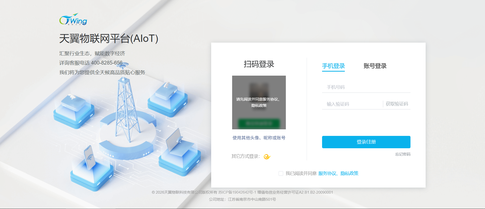

#### 1.2 成员管理

进入"成员管理"，添加/确认要调用 API 的成员（工号/账号）。项目配置里的 `operator` 就取自这里。

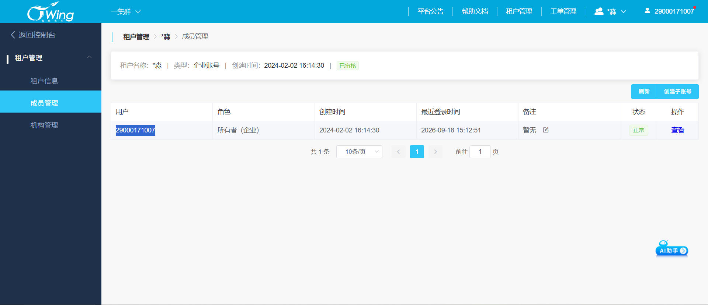

#### 1.3 创建应用

在"应用管理"中创建应用，然后到应用详情复制 `appKey` / `appSecret`（开放 API 签名凭证）。

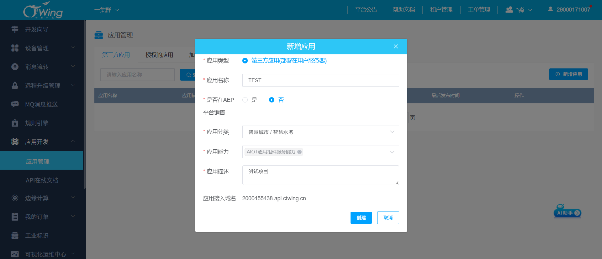
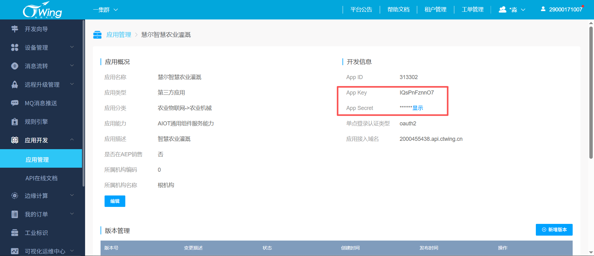

#### 1.4 开通 API 服务

在应用中开通本项目所需的开放 API：`设备管理`、`指令下发`。未开通时调用会提示无权限。

#### 1.5 下载 SDK

ctwing AEP 的 SDK（`ag-sdk-biz`、`ctg-ag-sdk-core`）**未发布到 Maven 中央仓库**，jar 包只在平台控制台的 **应用管理** 详情页面下载。

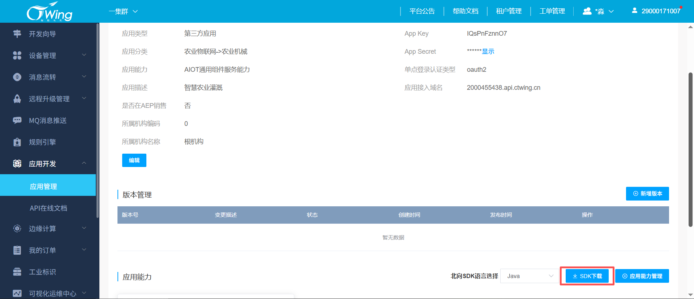

#### 1.6 创建产品

在"产品管理"中创建产品。**产品 = 协议 × 物模型**：同一种设备不同协议属于两个产品，本项目即为 球阀(NB, LWM2M) 与 球阀(4G, MQTT) 各建一个。

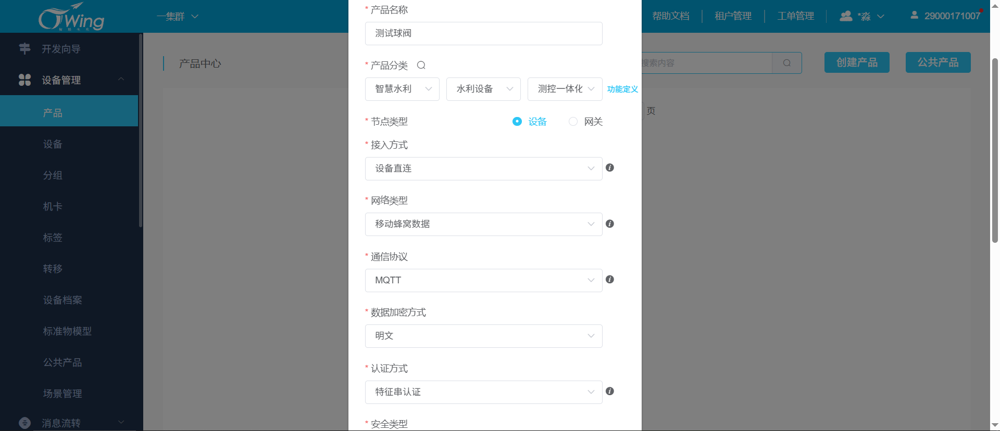
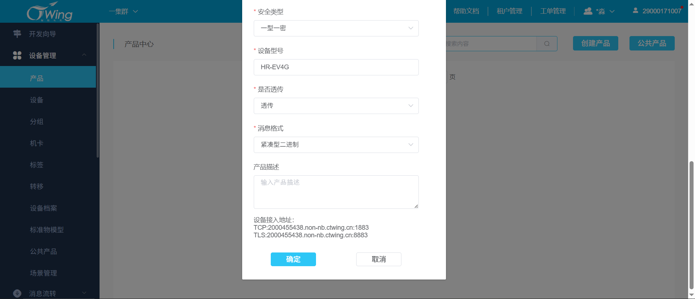

**复制产品密钥**：进入产品"概况"页，复制 `productId` 与 `masterKey`，它们是调用该产品 API 的凭证，稍后填入 `aep.send.products`。

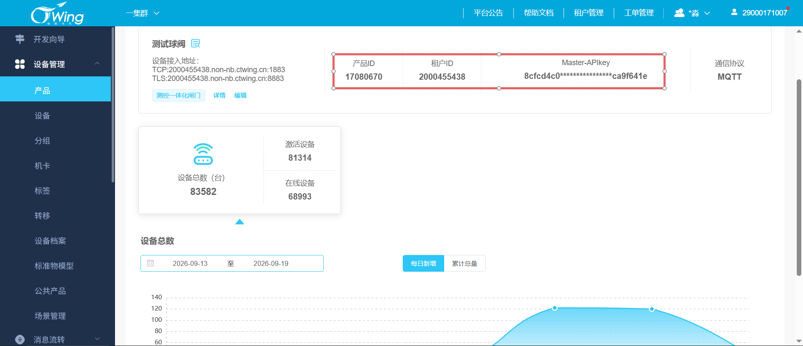

#### 1.7 消息流转

##### 1.7.1 目的地管理

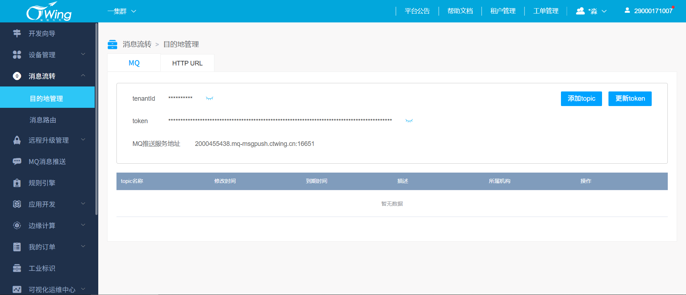

在电信 AEP 平台中，当你的第三方应用服务器需要接收设备数据时，**消息目的地**提供了两种接入形式：**MQTT 主题订阅**和 **HTTP 回调**。

这两种方式虽然目的相同，但在连接机制、可靠性保障和适用场景上有本质区别。以下是完善后的详细描述：

**1. MQTT 主题订阅（长连接模式）**

- **工作机制**：你的服务器需要作为一个 MQTT 客户端，主动连接到平台提供的 `MQ推送服务地址`，并订阅指定的 `Topic`。双方建立并保持一个 TCP 长连接。
- **可靠性保障**：依赖 MQTT 协议原生的 QoS 机制。通过消息确认与重传机制，从协议层面保证消息不丢失、按序到达。
- **适用场景**：对实时性要求极高（毫秒级）、数据上报频率高、或需要双向通信的场景。例如：车辆实时轨迹追踪、工业设备高频状态监控、远程实时控制指令下发。
- **特点**：实时性最强，但开发复杂度较高，需维护长连接、处理断线重连及心跳保活。

**2. HTTP 回调（短连接模式）**

- **工作机制**：你只需在平台配置一个公网可访问的 URL。你的服务器无需保持长连接，而是被动等待平台发起 POST 请求推送数据。

- **可靠性保障**：依赖应用层的“响应+重试”机制。

  - **成功判定**：你的服务器必须在极短时间内（通常 <3秒）返回 HTTP 200 状态码。
  - **失败重试**：若超时或未返回 200，平台会自动触发阶梯式指数退避重试（如间隔 1s -> 5s -> 10s...）。
  - **熔断保护**：若连续失败达到一定次数（如 2000 次）或时长（如 24 小时），平台将自动停推。

- **适用场景**：业务逻辑处理为主、低频数据上报、告警通知等场景。例如：智能水表日用水量统计、设备故障告警推送、订单状态更新。

- **特点**：接入简单（标准 Web 接口），服务器平时不消耗资源，但需注意处理重试导致的消息重复问题（需做幂等去重）。

##### 1.7.2 消息路由

创建**消息路由**的目的是在庞大的物联网设备群中，**实现对海量数据的“精准筛选”和“定向投递”**

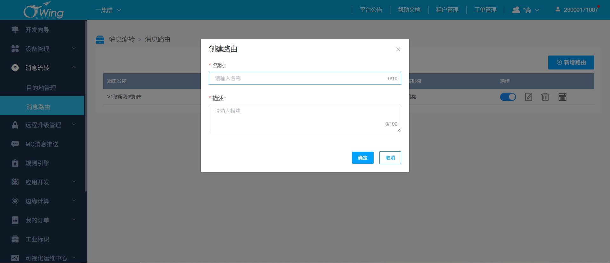

为每个路由设置不同的**设备来源**和**目的地**

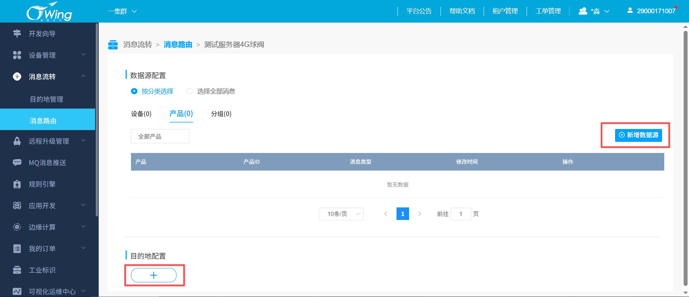

#### 1.8 MQ消息推送

`消息路由`和`目的地管理`只是搭建了数据流动的**通道**，只决定把哪些设备发送到哪个目的地。而当前页面则是用来配置每个产品具体发送哪些**事件**的数据。

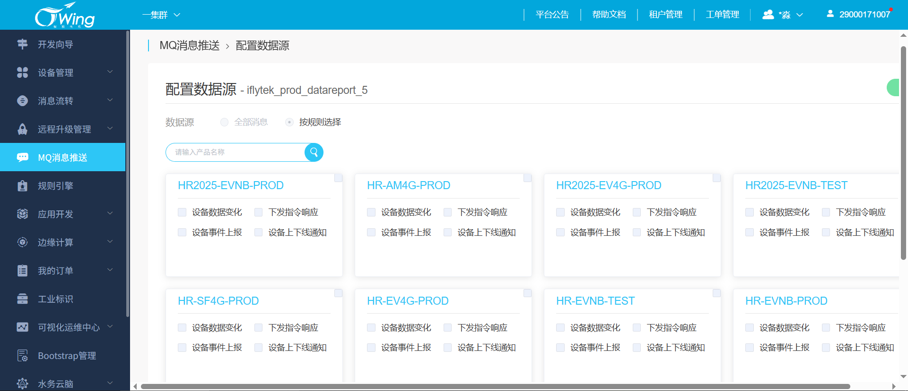


### 2. 项目配置

#### 2.1 将下载的 SDK 放到项目 lib 目录

项目已在 `lib/` 内置 SDK（`ag-sdk-biz` / `ctg-ag-sdk-core` 2.8.0，以及北向接收 `mq-msgpush-sdk` 1.1.0），clone 即编译。若从平台下载了 AEP 发送侧新版本，按 Maven 本地仓库布局（groupId/artifactId/version）放入 `lib/`，jar 与同名 .pom 一起放：

- `lib/com/ctg/ag/ag-sdk-biz/<版本>/`
- `lib/com/ctg/ag/ctg-ag-sdk-core/<版本>/`

并同步修改 `pom.xml` 中的 `<ctg.sdk.version>` 版本号。`pom.xml` 通过 `file://${project.basedir}/lib` 文件仓库引用，无需安装到本机 Maven 仓库。

#### 2.2 配置平台凭证与产品密钥

把第 1 节在平台侧拿到的参数按下表填入配置文件：

| 参数 | 来源 | 填入位置 |
|------|------------------------|----------|
| `appKey` / `appSecret` | 1.3 创建应用 | `aep.send.app-key` / `aep.send.app-secret` |
| `operator` | 1.2 成员管理 | `aep.send.operator` |
| `productId` / `masterKey` | 1.6 创建产品 | `aep.send.products` 中每个产品的 `product-id` / `master-key` |

`aep.send.products` 是「设备类型 × 协议 → 产品」的映射表，一个元素一个产品：同一种设备不同协议 = 另一个产品，每个都要填写 productId / masterKey。

```yaml
aep:
  send:
    products:
      - type: BALL_VALVE   # 设备类型（DeviceType 枚举名，不区分大小写）
        protocol: "4G"     # 协议类型：4G / NB
        product-id: 17080670      # ← 填 1.6 复制到的产品ID
        master-key: 8cfc...       # ← 填 1.6 复制到的产品密钥
      - type: BALL_VALVE   # 同类型不同协议 = 另一个产品
        protocol: "NB"
        product-id: 17070058
        master-key: eae8...
```

> 以上写入 `application-prod.yml`（默认激活 prod，可直接运行）；`application-dev.yml` 中为占位值 123456，联调真实平台时替换即可。同级还有接收侧 `aep.mq`（北向消息推送），发送/接收两套配置统一归在 `aep:` 下。

#### 2.3 Profile 文件与激活环境

配置按 **Spring Profile** 分文件管理，`application.yml` 放公共部分并声明激活条件：

| 文件 | 内容 | 适用环境 |
|------|------|----------|
| `application.yml` | 服务/端口 + 激活哪套环境的条件 + SQLite 数据源与 `schema.sql`/`data.sql` 初始化 | 公共 |
| `application-prod.yml` | `aep.send`（平台认证 + 产品映射）与 `aep.mq`（接收侧）全量配置（含默认值） | prod |
| `application-dev.yml` | 同上（占位值 123456，联调时替换） | dev |

激活条件写在 `application.yml`：`spring.profiles.active: prod`。本地库为 SQLite（`jdbc:sqlite:/ctwing.db`），启动时自动执行 `schema.sql`（建 `device` 表）与 `data.sql`（种子设备）。默认启用 **prod**，切换方式：

```bash
export SPRING_PROFILES_ACTIVE=dev      # 环境变量
java -jar app.jar --spring.profiles.active=dev   # 启动参数
```

> **设计约定**：前端所有接口只传业务语义 `deviceType`（设备类型）+ `protocolType`（协议），**不接触任何产品信息**。产品(productId/masterKey)由服务端 `AepProductResolver` 按 (deviceType, protocolType) 从 `aep.send.products` 中解析，现有 9 种设备类型中仅 **球阀(BALL_VALVE)** 已配置 4G/NB 两个产品，其余设备类型接入时按需追加配置即可。

#### 2.4 设备类型字典（`DeviceType` 枚举）

| 枚举值 | 设备类型 | 典型接入协议 | 是否已配产品 |
|--------|----------|--------------|--------------|
| `BALL_VALVE` | 球阀 | 4G(MQTT) / NB(LWM2M) | 是（4G、NB） |
| `BUTTERFLY_VALVE` | 蝶阀 | 4G | 否 |
| `FERTIGATION_MACHINE` | 水肥机 | 4G | 否 |
| `WATER_PUMP` | 水泵 | 4G | 否 |
| `VIDEO_CAMERA` | 摄像头 | 4G | 否 |
| `WEATHER_STATION` | 气象站 | 4G / NB | 否 |
| `SOIL_MONITOR` | 土壤墒情监测仪 | NB | 否 |
| `PEST_MONITORING_LAMP` | 虫情测报灯 | 4G / NB | 否 |
| `SPORE_COLLECTOR` | 孢子捕捉仪 | 4G | 否 |

---

## 二、设备控制时序

设备全生命周期分两个阶段：**注册与状态同步**、**设备控制**，两份时序分别如下。

```
应用客户端 (Web/App)  ──►  服务端 (本Spring Boot服务)  ──►  AEP平台 (电信ctwing)  ──►  设备客户端 (NB/4G球阀)
```

### 1. 注册与状态同步时序

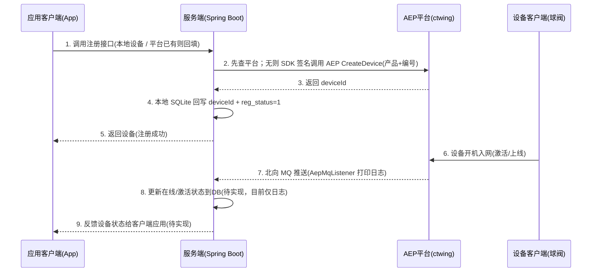

### 2. 设备控制时序

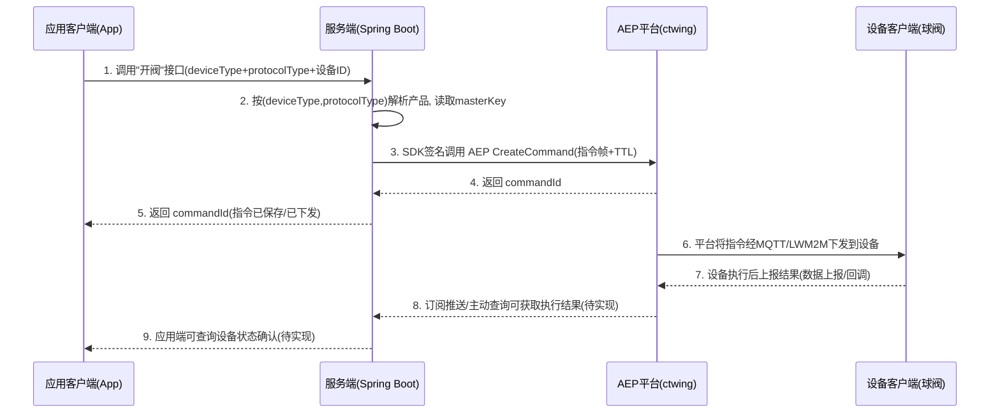

整体链路：**应用客户端只与服务端交互**，服务端通过官方 SDK 携带签名调用 AEP 开放 API，AEP 把指令下发给在线的设备客户端，设备执行后回流结果。签名、时间戳、版本等公共鉴权参数由 SDK 自动处理，服务端不对平台暴露任何内部配置。

---

## 三、已实现功能

### 设备管理

> 本地设备增删改/注册/取消注册走 `/api/device*`（默认页 `index.html`）。

- **本地设备列表** `GET /api/device`（可选 `keyword`：sn/name/type/model 模糊）
  仅基础信息：`sn/name/type/model/proto/deviceId/regStatus`；球阀 mode 等参数在 `static/valve-config.json`。
- **本地设备详情** `GET /api/device/{id}`
  按本地主键查询；从 `index.html` 点「调试」进入 `debug.html?id={id}` 时用此接口取数。
- **本地新增/修改/删除** `POST|PUT|DELETE /api/device[/{id}]`
  已注册设备不允许删除，须先取消注册。
- **注册 / 取消注册** `POST /api/device/{id}/register|unregister`
  后台先查 AEP：注册有则回填 deviceId、无则创建；取消有则删除、无则仅清空本地 deviceId。
- **查询平台设备列表** `GET /api/aep/device`
  `deviceType` + `protocolType` 必填；可选 `searchValue`、`pageNow`（默认1）、`pageSize`（默认20，最大100）。
  `searchValue`：设备名称、设备编号(deviceSn) 为**模糊匹配**；设备ID、IMEI 为**完整值精确匹配**；NB(LWM2M) 支持按 IMEI 查询。
- **查询设备详情** `GET /api/aep/device/{deviceId}`
  `deviceType` + `protocolType` 必填。返回含 `deviceStatus`（0已注册/1已激活/2已注销）、`netStatus`（1在线/2不在线）。
  **只支持 AEP 设备全ID（产品ID + 设备SN）**。

### 设备控制

> 设备控制走讯飞球阀指令 `POST /api/aep/command/iflytek/valve`（页面 `debug.html` 调用）。

### 北向消息（接收侧）

> 容器启动后 `AepMqListener` 按 `aep.mq.*` 自动订阅 MQ 推送；未配置 `server`/`topics` 则跳过。收到消息仅格式化打日志（可按硬编码 deviceId 过滤），暂不回写数据库。

---

## 四、目录结构

```
spring-boot-ctwing/
├── lib/                                # 本地 SDK 文件仓库(ag-sdk-biz/ctg-ag-sdk-core 2.8.0、mq-msgpush-sdk 1.1.0)
├── doc/ctwing_sdk/                     # 官方SDK参考：jar、API文档、demo
└── src/main/
    ├── java/net/xzh/ctwing/
    │   ├── CtwingApplication.java      # 启动类
    │   ├── common/                     # 全局异常处理
    │   ├── config/AepProperties.java   # 平台认证与 aep.send.products 产品配置
    │   ├── controller/                 # 本地 DeviceController + Aep 设备/指令两组接口
    │   ├── mq/                         # 北向接收：AepMqListener / AepMqProperties
    │   ├── model/
    │   │   ├── entity/                 # Device 本地设备实体
    │   │   ├── enums/                  # DeviceType / DeviceModel 数据字典
    │   │   ├── request/                # 前端入参(@RequestBody对象)
    │   │   ├── response/               # 前端出参(Result统一信封)
    │   │   └── dto/
    │   │       ├── param/              # AEP入参(平台请求体)
    │   │       └── result/             # AEP出参(平台响应结果)
    │   ├── repository/                 # DeviceRepository（SQLite device 表）
    │   ├── service/                    # 集成层：AepDeviceService / AepCommandService
    │   │                               # 业务层：DeviceService / AepProductResolver
    │   └── util/                       # HexUtils / IflyTekValvePayloadUtil（讯飞球阀组帧）
    └── resources/
        ├── application.yml             # 公共配置 + Profile 激活 + SQLite 初始化
        ├── application-prod.yml        # prod 产品/MQ 配置
        ├── application-dev.yml         # dev 产品/MQ 配置
        ├── schema.sql / data.sql       # device 表结构与种子数据
        └── static/
            ├── index.html              # 设备列表（本地/平台两页签）
            ├── debug.html              # 球阀调试页
            └── valve-config.json       # 球阀型号阀控参数
```

---

## 五、注意事项

1. **设备编号唯一**：同一产品下 IMEI/设备SN 必须唯一，重复创建会失败。
2. **上线后才能控制**：为 NB 设备下发指令前建议先确认设备已激活上线（INACTIVE 设备无法接收指令）。
3. **指令 TTL**：建议 60~300 秒，设备离线期间指令会按 ttl 在平台缓存。
4. **协议差异**：NB 走 LWM2M 指令下发的 content（`dataType`/`payload`）与 4G 不完全一致，本项目统一按 TCP/LWM2M 透传 HEX 方式下发，已覆盖球阀场景；其他协议透传格式见 SDK 文档《指令下发》。
5. **产品配置**：`aep.send.products` 支持多个 (设备类型, 协议) 对应同一产品，也支持同设备类型多协议分产品；产品未配置时接口会明确提示，不会静默使用错误产品。
6. **凭证替换**：appKey/appSecret/masterKey 为演示项目示例值，接入真实平台时替换为自己租户的凭证。