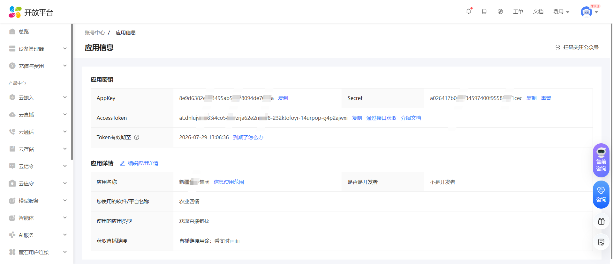

# 萤石开放平台 OPEN API

## 功能清单
- 获取应用访问凭证（appKey 和 appSecret 可在官网-开发者服务-[我的应用](https://open.ys7.com/console/application.html)中获取）
- 查询设备列表
- 获取设备播放地址

## 访问地址

【开源】Jessibuca播放器：支持通过 HTTP 或 WebSocket 获取的 FLV 流

http://localhost:8080/index.html

【SDK】官方WEB页面嵌入

http://localhost:8080/index_frame.html